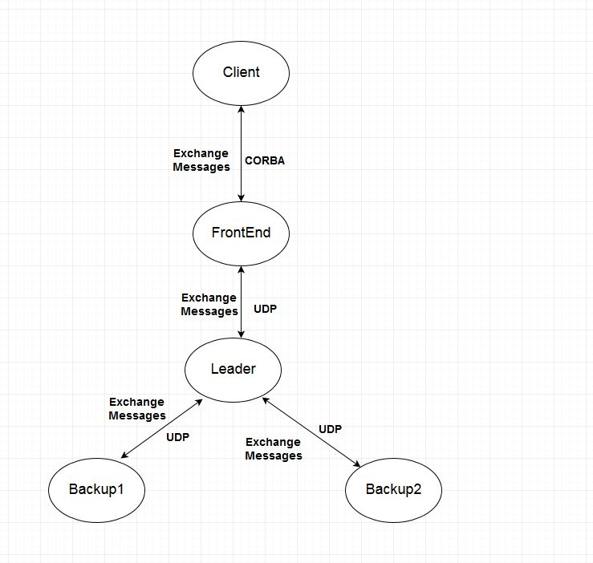
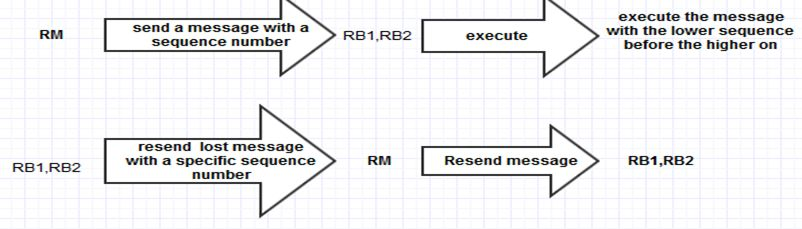
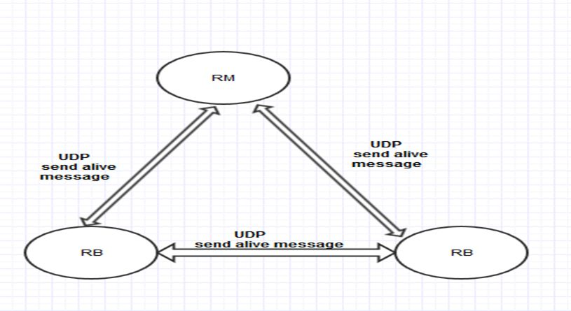

## Requirements
 
# Use ClinicManagement implementation with server replication system
  * server process replication
  * reliable group communication
  * failure detection
  * leader election

# Server process replication
* One leader and two backups
* Database synchronization for each request

# Reliable communication
* FIFO broadcast using UDP
* Lost messages recovery
	
#  Failure detection
* Subsystem in which processes check each other.
* Remove failed process from group.
* If leader fails, elect new leader.
* Use bully algorithm to elect a new leader.

# Leader process receives client instructions and replicate them
* Receive response from replicas
* Single response to the client
* Make broadcast reliable
  * Sequentialization
  * Timeouts

## Implementation 
# Client:
* Create and send request to the front end system using CORBA e.g create Doctor or Nurse Record.
# Front End:
* Receive client request, wrap the request and sequence number  in a message object, and send the message to replicate manager to handle the request using UDP. Then wait for the replicate manager to return a result. Finally, return the result to the client.
# Replica manager:
Selected replica that communicates with frontend and synchronizes backup replicas.
* Receive messages from FrontEnd, client request.

* Execute the messages in order, using the sequence inside the message. 
  * In case of lost messages, Replica manager send “message lost request” to FrontEnd. The message must have a sequence number of the missing message. Finally wait for the missing message before handling any more messages .   

* Send a message that has the new system status to the backups using UDP (with each message Replicate manager attach the     	sequence number received from FrontEnd for FIFO broadcast).
  * For Example, when the  Replica manager receive create doctor request it creates the new doctor record and build a message that has the doctor record and sequence number received by the FrontEnd, and send this message to replicate backups. 
* Wait for replicate backups to return a result.
* Return a result to FrontEnd.
 
# Replica backups:
* Receive updates from Replica manager.
* Verifies ordering based on FIFO broadcast (First update execute before the second).
* Applies changes to local database
* Return a result to replicate the manager.

# FIFO System
The FIFO system is encapsulated by the message system, which is composed by several classes, the main implementation uses the creation of a <b>Message</b> object and the generation of a monotonic increasing sequence number generated by the <b>FrontEnd</b> (synchronize method nextSequenceNum) that goes with the message. The <b>Message</b> is then assigned an operation code, arbitrary int value for each of the functionalities of the server (e.g. 1 = create doctor). The Message is sent through the <b>MessageTransport</b> object that will use the method sendTo to route the message to the Replica Manager (in case it's sent by the FrontEnd) or one of the Replicas (in case it's sent by the Replica Manager).
The receiving end is dealt by a <b>MessagesCenter</b> object, which is created on the constructor of every server instantiation. The message center keeps track of:
 * state of current instance (manager or replica);
 * port number to listen to;
 * port of the manager server;
 * instance of the calling server;	
 * server ID;	
 * information about the group of servers;

The <b>MessagesCenter</b> is the core of the whole FIFO and Message system. It carries the implementation of the <b>FIFOMessages</b> Class and implements the <b>ServerOperationMessage</b> Class which listens to udp messages. When used by the FrontEnd the <b>ServerOperationMessage</b> listens and receives requests for lost messages, when used by the servers, it listens and receives messages.

# Failure Detection
Every server in each group has an implementation of the The PingSystem Object. The ping system will send an udp request every 3 seconds to the two other servers in the group to check for crashes. If a response is not received in 1 second by the ping system it will mark that replica as crashed and in case of the Replica Manager it will stop sending the new requests to that replica.  
In the case that the leader is the one that fails the remaining two replicas will start the leader election system.

# Leader Election
When the failure detection system discovers that the replica manager process has crashed it will call for the leader election of a new replica manager. The process that discovered the crash verifies the server group if there exists a process with a smaller process id than itself. In that case it just sends a leader election call to that process and rests. The smaller id process has the responsibility to verify any other smaller process including the current manager. If the current process discovers it has the smallest process id alive it will send a message to the FrontEnd notifying it is the new replica manager by communicating it’s port number. The other backups will also be notified to update their replica manager identification info. The new replica manager also has to switch a flag from replica to replica manager. This flag is used when the server deals with new requests messages.

# Conclusion 
			
The system is A Clinic Management implementation with five process.A client process that send requests,such as creatDoctor Record, to the front end process using CORBA.Then, a FrontEnd process receive the client request, wrap the request and sequence number  in a message object, and send the message to replicate manager process to handle the request using UDP Finally, the  replicate manager process receive messages,” client requests” ,from FrontEnd, execute the messages in order, using the sequence inside the message, and send updates to the two backups processes.  
All messages exchanging and executing between the FrontEnd process and replicate manager process or  the replicate manager process and  backups processes are conforming with a reliable FIFO broadcast description.To explain, All messages are execute in order using the sequnces number inside the message and lost messages is requsted to resend  from its source.
Finally, the server replication system  has a failure detection subsystem in which the processes in the group periodically check each other and remove a failed process from the group. If the group leader has failed, a new leader is elected using bully algorithm. Then, the new manager identity is to frontEnd and other processes in the replication system.
